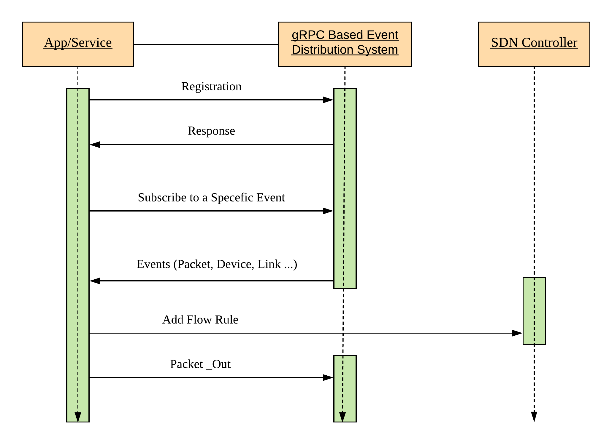

# Introduction 

# An Overview of DNOS Architecutre 

## Related Projects

## Publications

1. Douglas Comer, Rajas H. Karandikar, and Adib Rastegarnia. 2018. Umbrella: a unified software defined development framework. In Proceedings of the 2018 Symposium on Architectures for Networking and Communications Systems (ANCS '18). ACM, New York, NY, USA, 148-150. DOI: https://doi.org/10.1145/3230718.3233546 

## How to cite our work?

If you have a plan to use our work for your research, please cite our related work: [Bibtex](https://dl.acm.org/citation.cfm?id=3233546)
